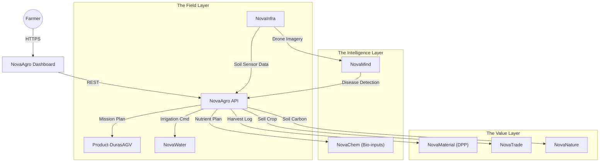

# 🌾 NovaAgro

> **The Operating System for Regenerative Agriculture.**
> Digital management of soil health, precision farming, bio-nutrient cycles, and sustainable food supply chains.

[](https://www.google.com/search?q=https://github.com/novaeco-tech/novaagro/actions)
[](https://opensource.org/licenses/MIT)
[](https://www.google.com/search?q=https://agriculture.novaeco.tech)

**NovaAgro** is the Vertical Sector responsible for the **Food System**. While `NovaNature` manages wild ecosystems, **NovaAgro** manages productive land. It connects the biological reality of the soil (Microbiome, NPK, Carbon) with the technological layer of farm management (Robots, Irrigation, Markets).

It acts as the compliance engine for the **EU Farm to Fork Strategy** and the **Common Agricultural Policy (CAP)**.

-----

## 🎯 Value Proposition

Modern agriculture faces a crisis: degraded soil and broken supply chains. **NovaAgro** digitizes the transition to regeneration:

1.  **Precision Regeneration:** Instead of blanket spraying chemicals, it uses data to apply bio-nutrients (recovered via `NovaRecycle`) exactly where needed, down to the centimeter.
2.  **Farm-to-Fork Transparency:** Creating an immutable history for every harvest batch, proving it is organic, fair-trade, and carbon-negative.
3.  **Automated Stewardship:** Orchestrating autonomous fleets (like `DurasAGV`) to perform labor-intensive tasks like mechanical weeding without soil compaction.

-----

## 🏗️ Architecture (The Digital Farm)

NovaAgro acts as a Farm Management Information System (FMIS) on steroids. It aggregates data from the field and commands physical assets.



### Integrated Services

  * **[NovaInfra](https://www.google.com/search?q=https://infrastructure.novaeco.tech):** Manages the "Internet of Soil"—moisture probes, weather stations, and drone bases.
  * **[NovaMind](https://www.google.com/search?q=https://mind.novaeco.tech):** The agronomist. Analyzes satellite NDVI imagery to predict crop yield and detect pest outbreaks before they spread.
  * **[NovaWater](https://www.google.com/search?q=https://water.novaeco.tech):** The irrigation controller. NovaAgro tells NovaWater: "Sector 7 is below wilting point; release 5000L tonight."
  * **[NovaRecycle](https://www.google.com/search?q=https://recycling.novaeco.tech):** The nutrient source. NovaAgro connects farmers with urban compost and recovered phosphates to close the nutrient loop.

-----

## ✨ Key Features

### 1\. The Digital Field Twin

A GIS-based map of the farm, divided into management zones.

  * **Soil Strata:** Tracks historical data (pH, Organic Carbon) for every square meter.
  * **Crop Rotation Planner:** Suggests the optimal sequence (e.g., "Plant Nitrogen-fixing beans after Corn") to regenerate soil health.

### 2\. Harvest Passports (Traceability)

Food safety and provenance.

  * **Batch Tracking:** "Batch \#55 of Tomatoes."
  * **Data Injection:** Links the batch to the specific weather conditions, irrigation logs, and soil tests from the growing season.
  * **Output:** A QR code for the consumer (`RetailLoop`) showing the full story of their food.

### 3\. Nutrient Circularity

Reducing reliance on synthetic fertilizers.

  * Integration with `NovaRecycle` (Compost) and `NovaChem` (Bio-stimulants).
  * Calculates the exact N-P-K requirement and orders organic alternatives from `NovaTrade`.

### 4\. Soil Carbon Credits

Monetizing regeneration.

  * NovaAgro logs "No-Till" practices and cover cropping.
  * It sends this data to `NovaNature`, which verifies the increase in Soil Organic Carbon and mints carbon credits for the farmer.

-----

## 🚀 Getting Started

We use **DevContainers** to provide a consistent development environment.

### Prerequisites

  * Docker Desktop
  * VS Code (with Remote Containers extension)

### Installation

1.  **Clone the repo:**
    ```bash
    git clone https://github.com/novaeco-tech/novaagro.git
    cd novaagro
    ```
2.  **Open in VS Code:**
      * Run `code .`
      * Click **"Reopen in Container"** when prompted.
3.  **Start the Sector:**
    ```bash
    make dev
    ```
      * **Dashboard:** http://localhost:3000 (Map-based Farm UI)
      * **API:** http://localhost:8000/docs

### Configuration (`.env`)

```ini
# Agronomy Settings
GROWING_REGION=USDA_ZONE_6B
CROP_DATABASE=FAO_ECOCROP

# Integrations
NOVAINFRA_URL=http://novainfra-api:8000
NOVAMIND_URL=http://novamind-api:50051
DURAS_FLEET_URL=http://product-duras-agv-api:8000
```

-----

## 📂 Repository Structure

This is a Monorepo containing the sector's specific logic.

```text
novaagro/
├── api/                # Python/FastAPI (Domain Logic)
│   ├── src/
│   │   ├── crops/      # Growth models (GDD calculation)
│   │   ├── soil/       # NPK and Carbon dynamics
│   │   └── planning/   # Seasonal scheduling engine
├── app/                # React/Leaflet Frontend (Farmer Dashboard)
│   ├── src/
│   │   ├── map/        # NDVI/Satellite layers
│   │   └── calendar/   # Task management UI
├── website/            # Documentation (Docusaurus)
└── tests/              # Integration tests
```

-----

## 🧪 Testing

We use **Biological Simulation** for testing.

  * **Growth Model:** `make test-grow`
      * Simulates a season of Corn with specific temperature/rain inputs. Verifies that the "Predicted Yield" matches standard agronomic models.
  * **Irrigation Logic:** `make test-water`
      * Simulates a drought event. Asserts that the system triggers `NovaWater` to irrigate *only* the water-stressed zones, conserving resources.

-----

## 🤝 Contributing

We need contributors with backgrounds in **Agronomy**, **Robotics**, and **Geospatial Data**.
See [CONTRIBUTING.md](https://www.google.com/search?q=../.github/CONTRIBUTING.md) for details.

**Maintainers:** `@novaeco-tech/maintainers-sector-novaagro`